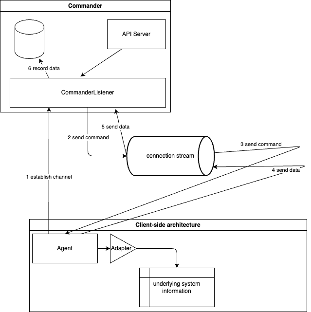

# Commander

Commander is a gRPC-based tool that provides client/server applicatinos to exchange generic messages between them.

## Architecture



## Contribute and develop

Build the project:

```sh
make build
```

Clean build directory:

```sh
make clean
```
