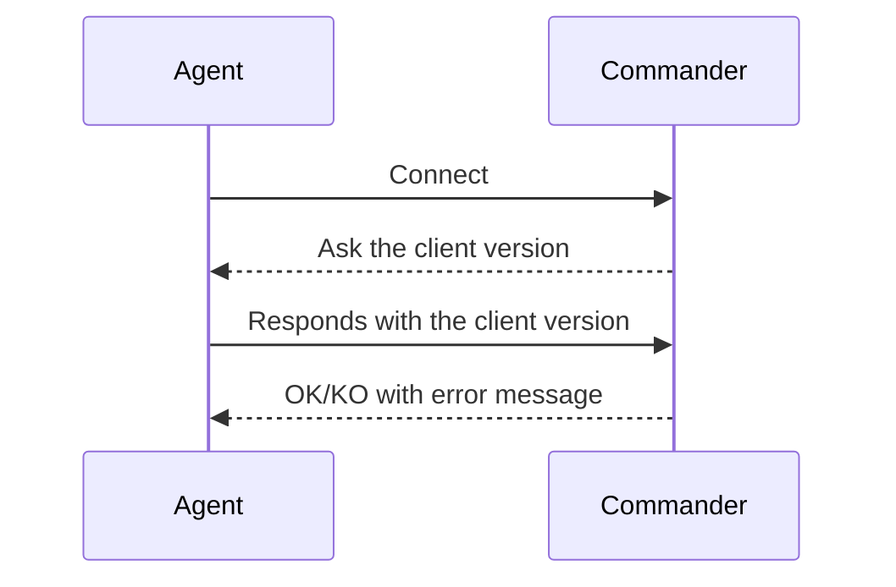

# Use cases

## Use case 1: Handshake

### Commander

- create server to receive connection from agent
- answer ok/ko compatibility with client, sending a message with the compatibility range

### Agent

- opens connection to the commander
- send the client version

## Use case 2: Invoke K8s API

### Commander

- create server to receive connection from agent
- once open the connection, send the command to agent to get K8s version
- print the k8s version

### Agent

- opens connection to the commander
- invoke the k8s API version
- send the version to the commander

## Use case 3: Invoke K8s API

### Commander

- create server to receive connection from agent
- exposes endpoint to receive commands from an API
- once invoked the API, send the command to agent to get K8s version
- reply to api with the k8s version

### Agent

- opens connection to the commander
- invoke the k8s API version
- send the version to the commander
